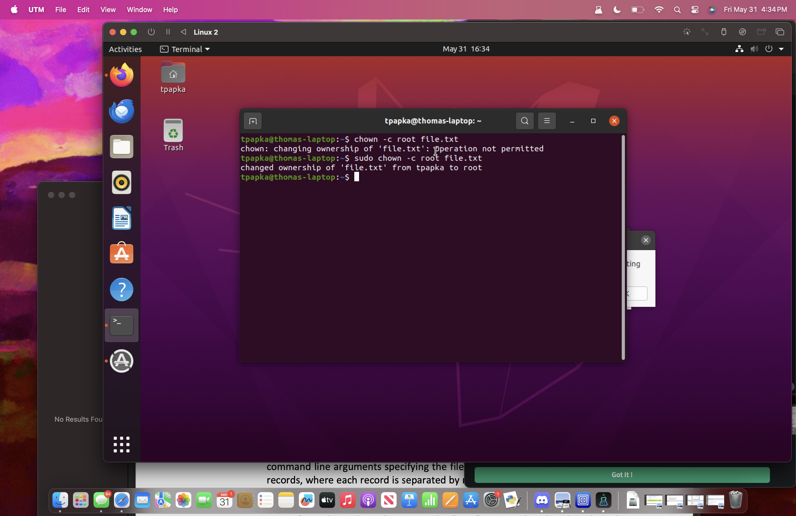
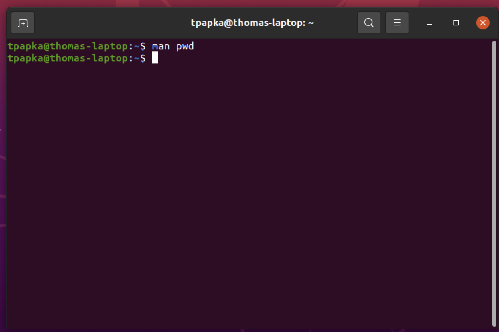

# Description of commands(Question 2)
* ssh- Provides a secure a connection between two hosts.
* ssh-keygen- Will create authentication key for ssh.
* scp- Allows for a secure connection when copying files between hosts.
* history-Displays commands you have used in the past.
* sudo-Grants security privleages to run commands.
* ip- This will let interact with the network interface and settings.
* dd- Used to copy and covert files.
* fdisk- Allows you to delete, create and manage parts on a hard drive.
* apt- Is used to install update and remove software packages.
* vi- This is used for text editing.
* time- This will measure the time it takes for a command to execute.
* tar- This will create and extract archives and used to compress and decompress files.
* cat- This will concatenate a file and is used to read and output a file. 
* watch- Runs a program and allows you to check on changes over time.
* ps- Displays information about processes currently running.
* top-Provides a real time view of system processes inclduing memory use and CPU.
* htop- A better verison of top that has better a better user friendly interface.
* gcc- Used to complie programs written in C and C++.
* tail- Will display the end of a file.
* grep- Allows for search of specific lines in a file.
* kill- Terminates a process using the PID.
* killall- Same as kill but terminates all processes with the specified name. 
* du- Shows the amount of disk space used by files and directories.
* df- Shows amount of disk space available.
* screen- Allows you to run multiple terminal sessions inside a one window and switch between them. 
* vim- This is a text editor that is a improved version of vi.
* chmod- Changes the permissons of a directory or file.
* chown- Changes ownership of a file or directory.
* useradd- Will allow for a new user to be added to the system.
* man- Allows for access to the manuel for all commands.  
* locate- Used to find the location of files by there name.
* find- Searches for files and directories based on things like name and size.
* sed- Used for finding and transforming text in a file.
* awk-A programming language and has uses on the command line for finding and processing patterns.
* diff- Compares the difference of files line by line.
* sort- Sorts lines of text files.
* export- Exports environment variables for other programs to use.
* pwd- Prints the directory the user is currently in.
* crontab- Plans for tasks to be run at specific times.
* mount- Addes filesystem to a directory it is used to mount external drives.
* passwd- Allows for the user to change password
* uname- Displays information about the system being used.
* whereis- Seraches for the source,binary, manual page files for a command.
* whatis- Provides a simple description of a command.
* su- Switches to another user and allows them to have orginal privileges.
* ping- This will display response time from a ip address.
* traceroute- Follows the path packets take to reach a network host and showing the steps to get there.
* date- Allows for display of date and time.
* wget- Allows for downloads for the internet.
* wc- Counts lines and words in file.
* pwgen- Generates passwords that are random.

# Screenshots

# Questions
100000 and 10000000 experiments exceed GitHub filesize limit.

| Problem Size | Generate | Sort |
|--------------|----------|------|
| 1000         | 2.78s |0.00s|
| 100000       |289.60s|0.29s|
| 1000000      |2647.32s|3.15s|

#Question 4
#A
The more processors you have the faster the code will run given the code can use it. You would want to set it to a minimum if the code does not need more processing power. Setting it to the maximum would be a good idea if the code was able to make use of all the processing power. It would be a bad idea to give it the maximum because it would divide the power from the rest of the computer. 
#B
**None**-This would be the least efficient choice because the guest OS would run without any optimziations.
**Legacy**- This uses older paravirtualization interfaces for older OS that would not support the newer paravirtualization methods.
**Minimal**-Provides little paravirtualization will be enough for basic optimization but not enough for advanced options. 
**Hyper-V**- Made for Windows guest OS and is the best for Windows in a VM.
**KVM**- This is the best verision to use as it is built into the linux kernel. It allows the user to interact directly with the hardware which will improve the performance.
#C
**IDE**- A old interface standard for connecting storage devices it is slower then most modern options.
Still would have use with old os that do not have compatability with new interfaces.
**SATA**- Newer then IDE and allows for higher data transfer and hot swapping it is common in modern PCs.
Ideal for most uses that do not require extremely high performance. 
**NVMe**- Made for SSDs this has a very high data speed transfer and low latency.
Would be used for any high performance applications that require these fast speeds.
#D
**NAT**- Allows for the VM to access external networks but they can not access the VM back.
Ideal for a VM to access the internet but not need it to be connected back from the internet.
**Bridged Adapter**- The VM now has its own IP address and appears as a seperate device. 
This would be ideal when testing network services or applications that need to be discoverable on the local network.
**Internal Network**- The VM can only communicate with other VMs on the same internal network.
Useful for setting up isolated environments for testing network configurations or applications without any risk of interference or security issues from the external network.
**Host-only Network**-The VM can communicate with the host and other VMs on the host-only network but not with external networks.
Suitable for development and testing environments where the VM needs to communicate with the host but not with external networks, such as when testing applications in a controlled environment.
#E
**USB1.1**-The oldest USB standard supported in VMs, with a maximum data transfer rate of 12 Mbps.
When you need to connect very old USB devices that only support USB 1.1.
**USB2.0**- An improved standard with a maximum data transfer rate of 480 Mbps. Widely used and supported by most devices.
Suitable for most general purposes, such as connecting USB storage devices, printers, or other peripherals that do not require the higher speeds of USB 3.0.
**USB3.0**- The latest standard supported in VMs, with a maximum data transfer rate of 5 Gbps. Backwards compatible with USB 2.0 and 1.1.
 Ideal for high-speed data transfer needs, such as connecting external SSDs, HD video cameras, or any peripherals requiring faster data throughput.